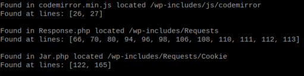

# Search for a string in text files
A simple Python script for recursively searching for a string in the text files. The script iterates for all the files inside a directory. Originally was created to perform a string search in the WordPress files, but it can be used for a recursive search in any files. Works on Windows and Linux

Usage
```
python search_for_a_string.py [-h] path search_for
```
path - an absolute or relative path of the directory you want to start search from  
search_for - a string that will be searching for

If the given string will be found in the file, a list with the lines where the occurence is, will be printed  


If you get an error **ImportError: No module named pathlib**, use python3 instead of python:
```
python3 search_for_a_string.py [-h] path search_for
```
